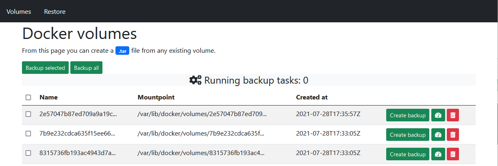

# Docker Backup

This tool is inspired in [this article](https://blog.ssdnodes.com/blog/docker-backup-volumes/) and is useful to create and restore backups from docker volumes.

## Deploy

Create a volume called `docker-backup` and configure `/path/to/files` to be a folder you can access to get files from or put them into (i.e `~/backup`).
```shell
$ docker volume create --opt type=none --opt o=bind --opt device=/path/to/files docker-backup
```
Bind the volume created and the docker socket.

```shell
$ docker run -d --rm -p 3000:3000 -v docker-backup:/backup -v /var/run/docker.sock:/var/run/docker.sock nu12/volume-backup-tool
```

Optionally, use `-e PASSWORD=your-password` to enable authentication.

## Usage

Use the `Volumes` page to view a list of all volumes available. Create a backup file using the `Create backup` button.



In the `Restore` page you can see all `.tar` files generated. You can also download created files and upload previously downloaded files.


Note: to manage large files, it's recommended to use external tools like scp, ftp, etc, and get the files directly from the mapped volume path.

## Development

Create a volume to run the application:
```shell
$ docker volume create --opt type=none --opt o=bind --opt device=/backup docker-backup
```

Create a local redis server:
```shell
$ docker run --name redis -p 6379:6379 -d redis
```

Enable authentication in development by editing `config/environments/development.rb`:
```ruby
config.password_enabled = true
if config.password_enabled
    config.password = 'dev-password'
end
```